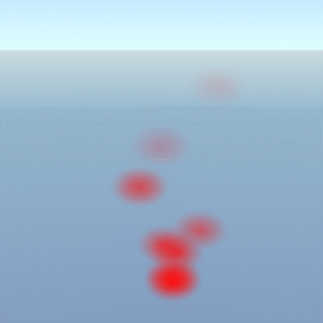
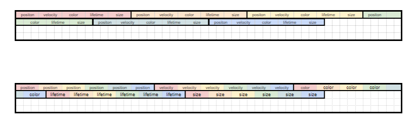
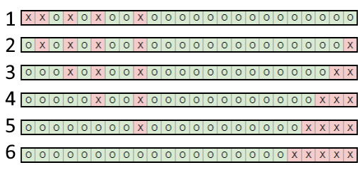
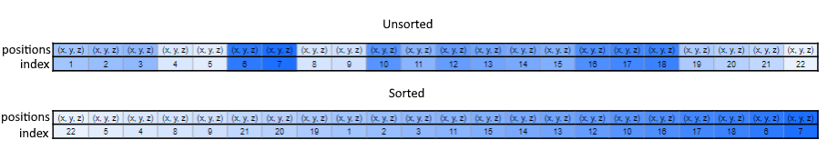

# Particles System

This post focus mainly on the implementation of a particle system and the optimization coming with it.

## Before working

### Definition

Particle are light weighted object that are drawn on the screen with a unique texture on it. In video games they can be found to symbolize impact with object or explosion. You're seeing blood splashing everywhere when shooting at someone? Those are most certainly particles. If a particle is a simple object with a lifetime and a speed behind it their is a particle system, in charge of spawning particle, retaining information about the numbers of active particle, it can also hold information about how the particles will be instantiated in the world and starting speed. More often you see particle system using particle emitter than contain the shape that emits particles.




### Needs of the game

The game defines how the particles will be used and in Star Of Anarchy they will take two major roles:
- Explosion of any type of objects (spaceships, asteroids, projectils)
- Damage indicator on the player depending of it's health

This mean that there is no complexe behavior with them but the engine must be capable of drawing a lot of them at the same time.

Here is the list of wanted behaviors:
- Displaying sprites
- Changing color of sprites over time
- Dying after a certain amount of time
- Being spawn from different type of shape

### Inspirations

It hard to do something that you’ve never done before. To help working one of the best solution is to look how to other handle those task. The easiest way to look up at something else was simply using Unity and to see what kind of parameters they gives and how they are applied to particles.  
 
It was also useful to use Unity because the prototype of the game was made on it so the game’s team wouldn’t be lost when working on the pok engine with parameters using the same name.

## Implementation

### Basic implementation

The most basic implementation is to have a data structure to represent any particles. A particles system that holds the information of how each of its particle behave and looks like. Finally there is an emitter that contain the shape from which the particles is emitted.
```c
struct Particle {
 uint32_t numberOfRows = 1;
 Color originalColor;
 Color colorOffset;

 ColorGradient colorOverLifetime;

 math::Vec3 position;
 math::Vec3 velocity;
 math::Vec3 change;

 math::Vec2 imageOffset1;
 math::Vec2 imageOffset2;

 float lifetime;
 float scale;
 float gravityEffect;

 float elapsedTime = 0.0f;
 float transparency = 1.0f;
 float imageBlendFactor = 0.0f;
 float distanceToCamera = 0.0f;
}
```

This implementation is what could be called human readable, it’s easy to implement and to read the code, for example moving a particle only needs

```c
for(auto& particle : particles){
// Code to check life time of a particle

 particle.velocity += 9.81; //Gravity
 particle.position += particle.velocity * deltaTime;
 
 //Code to change the color
 
 //Code to change the sprite drawn if there is multiple sprite
}
```

But for a code being human readable mean most of the time that it’s not friendly readable for the machine. Every computer like to have aligned data and doing the same operation over the same type of data because it can do its own optimisation while doing its calculation.

### Aligning data

To align data and to make it efficient every programmer should stop thinking with objects in his mind but with data. To take back our particle, aligning our datas means that instead of treating a particle like a single object, every informations of the particles needs to be treated as one for all particle. For example all positions of every particles are aligned next to each other and updated one after each other, allowing the code to be optimized



This allignement allow to have loop for each type of _action_ that are applied to every particles.

```c
// Code to check life time of a particle

for(auto& velocity : velocities){
 velocity += 9.81; //Gravity
}

for(int i = 0; i < velocities.size; i++){
 positions[i] += velocities[i] * deltaTime;
}

 //Code to change the color
 
 //Code to change the sprite drawn if there is multiple sprite
```

### Lifetime

A new problem is appearing, what happen when a particle is supposed to die? Every particle has its own minimum and maximum life time which is updated every frame. But then as we loop through each particles, it means that does not alive will be updated as any other particle. 

Adding a condition in every loop to check if a particle is still alive would work but be horrible. The compiler - the program in charge of turning our code in readable code for the machine - is able to optimize some code on its own when it can see some sorts of pattern. Looping through each velocities and adding the current gravity is a pattern easy for the compiler to understand. But if there is a condition in the loop, it create differents branch each representing a differents outcome. Doing so, the compiler is unable to find a pattern and cannot do any optimization.

An simpler way is to swap a living entities with a dead one. It means that every dead entities are at the end of the array, and every alives particles are at the beginning of the array. By doing this little trick, there is no need of any condition in the used loop.



### Sorting

One of the most common problem in programming is sorting arrays of elements. Particles needs to be sorted from the farest to the closest of the camera. This is done to be sure to render particles and not having particle behind other being drawn in front of them. And to sort them we need to compute the distance from the camera to the particle, the distance between two points needs a square root to be done, one of the worst performance function you can make a computer do.

To solve the issue with the needs to sort every array of every data needed to draw a particle, first of all, to drawn a particle, the gpu - Graphics Processing Unit, it’s in charge of rendering everything to the screen - doesn’t need to know about the lifetime of a particle.  So less data need to be sorted. Secondly not every arrays of data need to be sorted, one trick is to sort only the positions and keeping an array of sorted index, to then take the needed info in a sorted order.


To avoid the square root, in place of using the correct function it’s possible to use the Manhattan distance. This function remove the need of the square root, and even thought the values of the distance are incorrecte, their are consistently incorrect, it means that object can be sorted using this function.

### GPU Instancing

The last part that need to be optimized is on the GPU side. GPU are good at drawing the same thing multiple time. What cost time is to change shader - programmes on the gpu to define how something is drawn on the screen - and if for every particles the shader is reset, even to the same one, it will cost time to the gpu.  

One solution is to use GPU Instancing, it a way of forcing the GPU to draw the same object a certain amount of time. For particles this is easy to implement as every particle need the same image drawn on a quad - 3d square -. 


## After thoughts

### How to know when to stop?

One defect that can be easily found in most programmers is to never been satisfied of their work. Their is always enough place to go deeper, to keep optimizing systems implemented, to tweak some function. Particle are a good trap, handling thousand and thousands of objects in some tight arrays are easy to monitor and to optimize.

But programmers needs to know when to stop, especially when working on indi/solo project 

where time constraints are less pressing. Optimization needs to be stop when the game can run with a smooth framerate and that those part are not causing probleme.  

The same problem can easily appear when adding features. Yet again particles are a good example, it’s easy to add new effect on particles like physics, changing size over time, changing speed over time and so on. But as for optimization, a programmer need to stop when he can use it’s features to accomplished to most basics implementation.

### Good resources
* Schiffman, D., 2020. The Nature Of Code. Natureofcode.com. Available [here](https://natureofcode.com/book/chapter-4-particle-systems). This is a realy complete blog about the implementation of a particle system with many features.
* Lorach, T., 2020.  Developer.download.nvidia.com. Available [here](https://developer.download.nvidia.com/whitepapers/2007/SDK10/SoftParticles_hi.pdf) Here is presentation on how at nvidia they handle soft particles.

