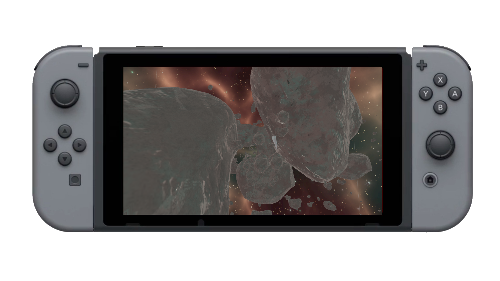
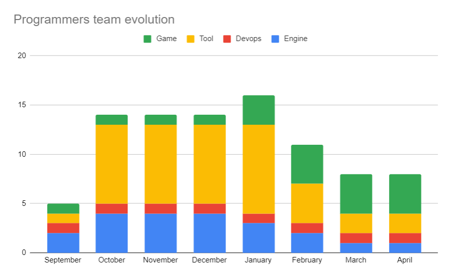
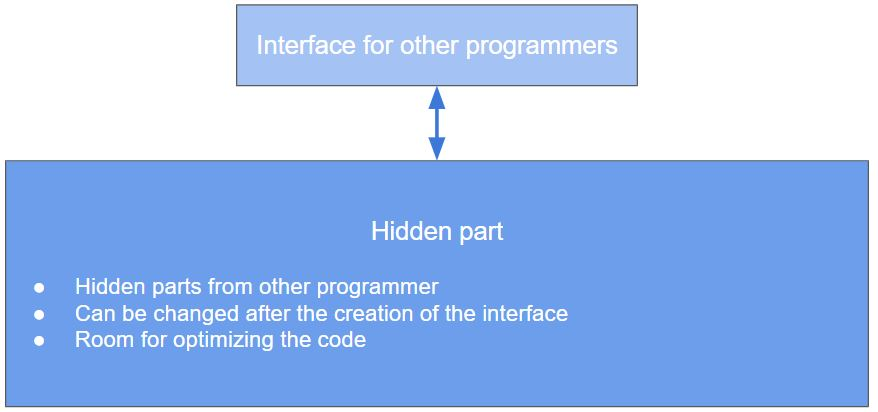
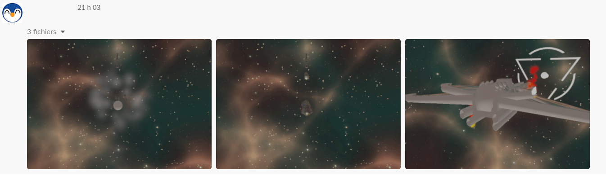

## Recap of the project

If throughout all those posts the main subject has been the engine itself, it's important to replace it into the scope of the full project. At the end of September, 3 of my comrades, our teacher and myself started talking about our specialization project. To sum it up it must be a 6 month project where everyone of us had the opportunity to go further it its favorite programming domains while doing a game for the switch with a custom engine.

## Pre - production

Even thought we were all eager to start programming as soon as possible, we had to do some basic management tasks in the project to set up everything properly. 

- Choose our roles in the project

- Come up with an idea for the game

- Plan the whole project over the six next months

### The team

#### Basics roles

The first task was to take every available roles. We had :

- A **lead project** that is also an engine programme. He then became latter a game programmer.

- A **lead design**, in charge of designing the game from the mechanics to the visual look of it. He is also a gameplay programmer

- A **lead tool** programmer/devops, working on tools and maintaining our repository

- A **lead programmer** who is also the lead engine programmer (me)

Through the course of six months the team changed a lot and the number keep increasing up to fifteen developers in total, mainly in the tool team. As I'm writing those line the team is counting three more members, two gameplay programmers and a tool programmer bringing up the total of developer to eight.

#### Lead Programmer

If the title _Lead Programmer_ sounds big and powerful in practice it was simpler tasks:

- Managing the team and choosing our working tools

- Following the overall schedule decided by the lead project 

- Choosing an overall coding style and philosophy when coding

- Keeping everyone focused on the project

In the end this role took around 10% of my overall work and it was the most time-consuming at the start of the project while deciding how to structure the work and the organization. Later in the project, it was more a role of following everyone and taking decision to cut some features to prioritize another.

#### Lead Engine

The second role was the real one. Being the _Lead Engine_ meant that the whole architecture of every system, every tool, every object depend directly on how the engine's implementation is being made. It also had a hidden task, to be fast enough to deliver something that could be used to make tools and a game without making anyone lose time.

It was my main role during the whole project and the most stressing one because is something went wrong with it, it would trouble the rest of the team. It means that the absolute priority was to make sure the engine was working at any time and if a bug/error was found by someone it had to be fixed as soon as possible. 

### Planning & Management

#### Milestones

The whole project used sprints of two weeks, inspired by agile method and for the programmers’s team is devised if four main steps
- **Pre tool** : A short period where the main focus was on the engine
- **Pre game** : 2 months where the focus was on tools
- **Game Critical** : 2 months where every game’s core feature needed to be doable
- **Game Plus** : The final month allocated to do some enhancement on the game.
  

#### Code review

Even though we’re all students, we have our own strength and weakness, to make to most of it we implemented code review validation for every task. Core review implies to look at some else code, understand how it works and to give constructive feedback on the implementation. Some people had to redo their task four to five times before their code was validated. Using code review makes the programming’s level of everyone quickly increase and helped keep an overall style.

### The game

It was important for us to have the basic idea of the game because this would shape the engine and every tool needed. It would also design the allocation of every human resource we had. Or design team settles down on Star Of Anarchy, a 3D rail shooter set up is space. 

## Production 

Now that all basic documents, idea, objectives were done it was time to start working on the actual project. The programmers team was divided in three main production team:
*   **Engine** : in charge of programming every core system of the engine, named the POK Engine 
*   **Game** : with the main objective to make firstly a prototype with Unity then making the game in our custom engine
*   **Tool** : that is making all needed tools for the everyone in the project in Unity or POK

### Working at full speed with three differents teams

To be the most efficient during the six months we had, every team must be able to work on something without having to scrap it later. It means that on an implementation point of view, everything that are used by someone else had to be easy to understand and can still be modified by the author later without causing trouble for users. 
A lot of core systems have two layers:
*   The visible one that we called “the interface part”. This part was created as soon as possible because those functions are possibly used by anyone on the team. 
*   The hidden one which is all the codes behind the function that user don’t need. 

This separation allowed us to have worked, but not optimized code and to later come back on some part and do the needed optimization. In some case it allowed to deploy version of the engine with accessible interface but no code behind, doing so made that no one was waiting on the code and could already implement the logic in their system without it working. 

### Remote works

As these lines are written, our team is in full isolation due to the SARS-CoV-2, a coronavirus that strike during the development of the project. It involved finding a solution to working from home and we’re not all equal while facing this situation.
 
Some live with their families, others have difficulties to stay concentrated while being in the same seat where they usually play. To fight all those problems we decided to implement three day meetings, 9am, 1pm and 5pm. We also all stays on a vocal channel and are constantly available for the other.  

Some lesson that we learnt was to have fixed hours of work, stay connected to each other, take a shower and put on some pants. It can look silly at first, but it’s important to create a new routine where we used to have a whole different one. 

### Leading by the example

There is different style of team leading, but being both the lead programmer and lead engine implies that the code produced as those roles had to be on a top notch level because it would be look and copy be everyone else. It means that every bad practice would be automatically reproduced and would take time to get rid of.

The biggest problem was that in the course of 6 months only working with the same language, c++ in this case, the level of any one would rapidly increase. It meant that something that was _okayish_ at the start of the project was a _big no no_ at the end. It grew frustrated with some people that had done something at the start of the project and that couldn't do it anymore at the end. Still, it was amazing to see the level of everyone increasing at a very fast pace.

### Keeping everyone happy

Working in a school project, with another project at the same time, other priorities, not having the same point of view on the scope of the project, stress from milestone led to some tensions in the group.

All seems to come from one in particular, the vision we had for the project. Some of us wants to keep this as a school project, without the intention of selling the game at the end and for them we are simulating a professional environment. For the other part we’re an indie studio making a game with the chance to do it in the school setting who to roles seriously and are going further than simply working from Monday to Friday. It led to some clashes between members.
 
To lower the number of clashes we introduce in the programmer team :
- Daily image, gif or video of the game. This was to help everyone seeing where we are in the project
- A better separation of tasks depending on who wanted to go further with the project
- Discussion with the whole team to settle things down on what we want the project to be

As today not everything is cleared up, but we all agree to at least use this project as a showroom of our capabilities.

## After Thoughts

### State of the project

At the time where this post is published the project is still in work in progress. The game is playable and can be edited via the editor. The state of the project could be considered as a prototype of what will be the final project. 

For the game all main mechanics are implemented and can be tested. Some work still needs to be done regarding the content and how to diversify the use of the core mechanics. From the editor every tool to build the game is done and every aspect of the game can be modified from its. The engine can work with up to 10’000 entities without suffering major framerate problems, but still needs a lot of work regarding the visual aspect of the game rendered by the engine. 

### New knowledge acquired

As said earlier, working six months on a project this size, with all those parts coming together with a team this big represents a fair amount of knowledge. They cover different areas:
*   **Team management**, during 6 months we tried differents type of organization, we had intern conflict and we setup complete workflow 
*   For the engine it was important to create custom **data structure** to answer each problem with its own solution
*   For this project to work, a huge part of the work was designing an **architecture** that would work for the game and the editor
*   In generals **c++** as this is the main programming language used in this project

### Where to go now?

The programmer is never satisfied with their work, there is still work to do, new features to implement, optimize some systems. For now the engine will keep working the six coming months. Tasks will be to maintain and updated the current systems. The goal is to keep it workable, follow the demands of the game team and make sure that the game is playable in the best condition possible.

### Good resources
* Gregory, J., n.d. Game Engine Architecture. 2nd ed. Is an excelent book about engine programming, anyone who desire to make its own engine should read this. The book can be found [here](http://ce.eng.usc.ac.ir/files/1511334027376.pdf)
* Unity is a good engine for quickly trying something, but also to take some inspiration from their user interface or how they tackle modern problem. Their [blog](https://blogs.unity3d.com/) is full of informations.
* Sonmez, J., 2020. Some Advice On Becoming A Lead Developer - Simple Programmer. Simple Programmer. Available [here] (https://simpleprogrammer.com/some-advice-on-becoming-a-lead-developer). Is a good starting article to be a Lead programmer
* Stroutsrup, B. and Sutter, H., 2020. C++ Core Guidelines. Isocpp.github.io. Available [here](https://isocpp.github.io/CppCoreGuidelines/CppCoreGuidelines). You can find here a lot of modern C++ (which is sometimes hard to find) and a real philosophy of programming.
* The [C++ coding style of google](https://google.github.io/styleguide/cppguide.html) is full of information on hidden C++ feature and contains golden rules to apply when programming ini C++.

# Thanks 
First to all my coworker for their amazing job thought all the project and doing all this project with me. I'm the kind of guy who tries to be honest and sometimes being honest also means not being nice to everyone, so thank you all for bearing that. You can check their own blog at those addresses:

Then through the course of the project we had multiple externals people having a look at the project. In particular Sylvain and [Anirul](https://github.com/anirul) who both helped the whole programmer's team developing  a solid project by giving us feedback on our idea or implementation.

Finally [Elias Farhan](https://github.com/EliasFarhan) our teacher, who played the role of the stakeholder. He also invited other game developer to which we had pitched the game and received advice on how to orient our work.  
