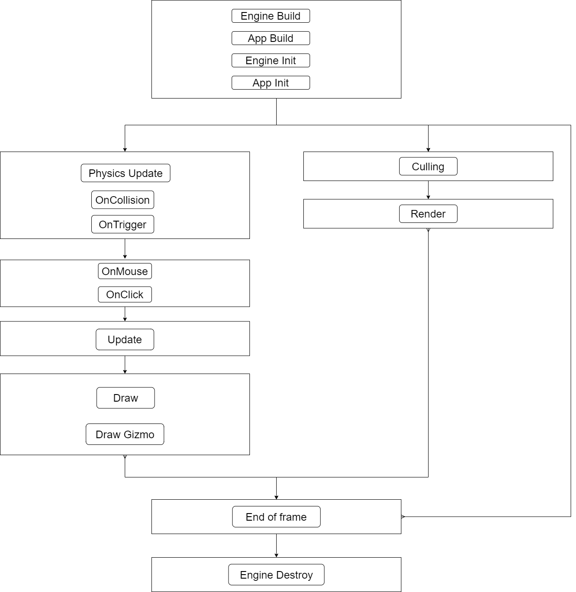

# How to make more in the same time?

In video games player always wants more, they want to see more stuff happening on the screen with high quality of graphics. They want to have more interaction with the world like the ability to destroy everything they see while not having objects passing through each other in a weird way.  

If this kind of game is feasible on high end pc specialized for video game, this is still some hard time when working on consoles or any kind of mobile device. One solution to do more with the same amount of time ( 16.66 ms per frame can be considered a default value ) is to multithread the engine.

## Introduction to multithreading

### What’s multithreading 

To really understand the concepts of multithreading we have to take a look inside computer (console and mobile works in the same ways but for the sake of keeping it short they’ll be ignored). Computer are composed of differents hardware parts and the one doing most of the computation is the CPU (central processing unit) it handle most of “logical” computation. When you’re doing 2 + 2 on a computer it’s the CPU that does this. There is another one which is the GPU (graphic processing unit) that display everything on the screen. Both of them can execute multiples “task” at the same time, by exemple you can listen to music while writing text.

This is possible because our CPU and GPU are what is called Core. This part is in charge of of the calculus and they are a physical part of modern processing unit. Each core can use Threads that are considered as a logical core. This can be see as both arms of a human. With each arm you can do two differents task or you can try to do 4 task, two with each arm, you won’t twice as fast but you’ll still be doing four task at the same time

### Why using multithreading in games

Because multithreading works well when the computer is doing two different task. Make an enemy fire at the player is not the same task as drawing each lights on the scene. Loading a resource (music, image, 3d object)  can be done while the game is already launched without the need to pause the game. 

But it’s not as easy as it seams. Let’s retake the example of the enemy who is shooting at the player. When the enemy shoot, it will instantiate a bullet that move via a physical body. Each frame the bullet will be moved, meaning that its position in the world will change. But what happen if at the exact same times the threads in charge of rendering (we’ll call it the rendering thread) everything try to display the bullet? Sometime nothing, the rendering thread juste display the object at the wrong position. Other time the programme will instantly crash.  
 
Those are called race condition and can be pretty common when a programme is multithreaded. There is two kind of solution.
*   The first one where you lock the informations while reading or writing it. But this solution is very costly in terms of performance and will drastically slow down our game.
*   The second type is trying to avoid the possibilities to write and read from two differents place, it can be done quite easily if this idea is in the mind of every one from the first day of the project.


### Example in AAA game engine

When regarding what is doing the major companies there is differents solutions implemented and this show something, even if multithreadings has been around for decades, there is not a general solution that works for every case. This is something to keep in mind while multithreading a game, it should work for your game, not for every game. 

## Implementation 

### Objectives for the engine

The main objective is to avoid having any locked data, the objective is to have complete separate data than can be access any time without the need to make sure to lock their access from anywhere else.  
 
Using this technique have one other benefits, the other programmers just need to know when it is safe to access each type of data without worrying about race condition. Doing so they can focus on their own part.

### Using 4 threads simultaneously 

For the implementation we went with 4 differents thread active at the same time, it matched the available number of thread on the switch.


#### App Thread

The one in charge of all the logic of the game:
*   Moving objects
*   Enemies firing at the player

#### Render Thread 

It where everything is drawn on the screen. All data will be prepared then sent to the gpu at once. Vulkan (our graphics api) come with some functionalities dedicated to work with multithreading.

#### Audio Thread 

We choose the api FMOD for handling all of our sounds in the game and it come with a native separated thread system that allow to play music or sound on another thread without blocking any other thread.

#### Worker Thread 

This thread is here to support the other threads in some task like loading resources, or computing some texture used by the graphics engine. It can also be used by the game if they have some heavy calculation where they don’t need the result immediately.

#### Being one frame behind

Using this technique has one drawback. If a the frame 1 the enemy is moving, it also means that it’s drawn using its previous position from the frame 0. And when finally at the frame 2, the Render Thread get the position from the previous frame, the enemy has kept moving and is in a new position.  
 
The Render Thread will always be one frame behind and for our game this is not a problem. When weighting between having twice as much objects or not being 16.66 ms seconds late, the choice was easy to made. Our game doesn’t rely on the player’s reflex, the accent is put on the number of explosion and object he can see at the same time. So the drawback is in fact not a drawback for us.


### Create an execution loop

To have a _safe_ moment where data can be access without having to be bother with race condition, the execution loop - in which order the main function of the engine will be executed - has to be a priority when designing the engine.



Each of those name can be seen as a set of function that are created anywhere in the engine and that will be executed following the order of the diagram.

#### Logic Thread

##### PhysicsUpdate

The first function to occur are related to physics. It assure that the elapsed time between each physical update is as close as possible. This has been made possible because the engine force a frame to be as least 16.66ms. In this pass every physical object is moved according to their speed and if two objects touch each other then message are sent to system that are listening in case two objects are touching each other.  
 
We made the choice to don’t resolve position by updating position and velocities of objects. It was made because the game simply doesn't need it. When two object enter with each other it will end up in one of them being destroyed.

##### Input

After all physical objects have been updated, every input that has happen are registered. It handle input from mouse, gamepad and the switch controller. This part also handle interaction with the windows like resizing or minimizing the window.

##### Update

Those function are mainly used by the game team to do all the logic it can implies :
*   Moving object
*   Firing at the player
*   Updating lifetime of a projectile 
*   Change the color of a light on a spaceship

##### Draw

The graphics engine - a sub engine in charge of drawing _stuff_ on the screen - needs a specific set of data to render an object and those data are created at that precise moment. For example when drawing the player on the screen the graphics engine only few informations (position, 3d mesh, materials) but doesn’t need to know the current health of the player.

#### Render Thread

##### Culling

This part works directly with the data created in the Draw pass. It will check if the object really need to be drawn. There is differents reason for it not be drawn:
*   Not visible by the camera (call frustum culling)
*   Hidden by an another object (call occlusion culling)
*   Too small on the screen (Not sure there is a name for it)
|Gif frustum culling|

Currently the engine only implement frustum culling but also use a custom type culling, the world is divided in chunks - rectangle- taht contains all static object that are update from the player's position.


##### Render

Rendering happen in this pass, in fact this is only calling the rendering function of the graphics engine where every data sent to the graphics engine in cullings function are sent to the gpu to be drawn.

#### End of frame

There is a single function in this part and this function is special because it has been made sure that there is no other threads working at the same time. It means that every data access is 100% race condition free. 

This is also here where if the scene need to change or  be reloaded that it will happen. It’s the same reason as earlier, the goal is to make sure that everything can be accessed without anything else accessing it at the same time. 

### Copying data from one thread to an another

One critical part when using this type gameplay loop is when you copy datas for severals reasons

#### Size of the datas

By having copies of data, the size of the engine can easily double if everything is copied from the logic thread to the render thread. But an important part is to know what is needed to draw something. By example the trails renderer :


To calculate the movement, next position, how the mesh will be created the trail renderer needs a lot of data
```c
struct TrailRenderer{
	   ResourceID materialID; // size_t
	   float lifetime = 1.0f;
	   float changeTime = 0.5f;
	   float widthStart = 1.0f;
	   float widthEnd = 1.0f;
	   float vertexDistanceMin = 0.1f;
	   math::Vec3 renderDirection = {0, 1, 0};
    bool isPaused = false;
   
private:
   	std::vector<math::Vec3> centerPositions_;
	   std::vector<TrailRendererVertex> leftVertices_;
	   std::vector<TrailRendererVertex> rightVertices_;
};

struct TrailRendererVertex{
    math::Vec3 centerPosition; 
	   math::Vec3 derivedDirection;
	   math::Vec3 position;
	   float creationTime;
	   float timeAlive;
};
```

But to be drawn the trail renderer need less data, only the index of the materials that is already in the gpu when the engine is launched, the mesh who is also the gpu and an index to be drawn in the forward pass (a forwad pass is a special type of passe where every object is drawn alone on the screen).
```c
struct TrailRenderDrawData{
   ResourceID materialID;
		 ResourceID meshID;
		 ModelForwardIndex forwardIndex; //size_t
};
```
The main point is the size of the struct which is way smaller and thus fixing this issue when copying datas from the logical thread to the render thread.

#### Time to allocate memory

Allocation of memory is one of the worst part in modern cpu. Here is an example where their is an already created array and then a new element is added to this array.

The problem here is that the computer doesn’t know what come after the existing array so it will need to look over the memory to find a new spot, it does means to copy all memory somewhere else in memory


It easy to imagine what would happen when copying data from one array to the other. Fortunately there is solutions to avoid allocation during the game is running. One of them is knowing the number of element that can be drawn at the same time.  
 
Let’s take an actual situation in the engine, due to gpu performance the number of light drawn at the same time has been limited to 256. It does means also that the size of an array can be know exactly from the moment the engine start to the moment it’s shut down.  
 
This imply to reserve space in memory in advance 


## After thoughts

### Pro and cons of the implementation

This is an easy implementation and easy to maintain and it perfectly fit our needs. But for bigger games that need even more stuff to happen there is a major drawback with this implementation. If the logic thread has finished all it’s work, it will just wait. 


There are a few other solution that can fix this problem but that way are more complex like a job system. In the current states of the engine, optimization on the multithreading are not required and as it doesn't need a lot of maintenance this implementation will certain last until the end of the project.

### Good resources
