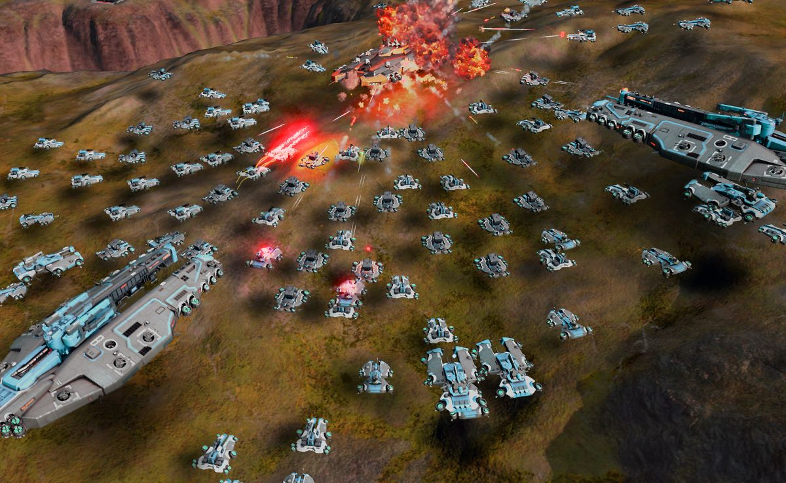
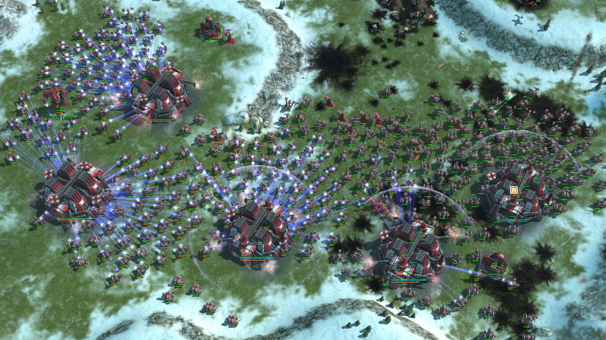

# Overview
This is my bachelor's project about **pathfinding and group movement**. To sumerize it here are the mains goal of the project:
- Movement of large group of agent while keeping a formation
- Using the new DOTS system of Unity
- Trying to keep it as close a possible from game and not just as a simulation
- Working closly with mentor from the industry
- The priority is the number, not the behavior

| The paper is still beeing written, it will be available here once it's finish |

# Inspirations
{: align="right" style="padding-left:16px; width: 250px;"}For this project I took inspiration from classic RTS like Age of Empire or Rise of Nation, but I wanted to bring it to modern technologies. One good example today is Ashes of the Singularity: Escalation which can handle **thousands of agents** using the new game engine: Nitrous Engine.  

{:align="left" style="padding-right:16px; width: 250px;"}I also wanted to have structured movement with formation like in Supreme Commanded 2. As this project is focused on having a large number, every formations will be kept simple with **primary shapes**: square, line, column and diamond. 

# Status
The project is still in development, if you want to see the project I sugest you to go have a look at the [repos](https://github.com/Surue/WarEconomy)