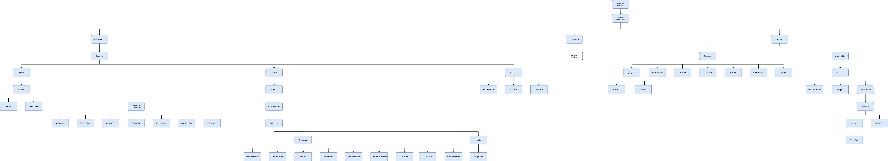
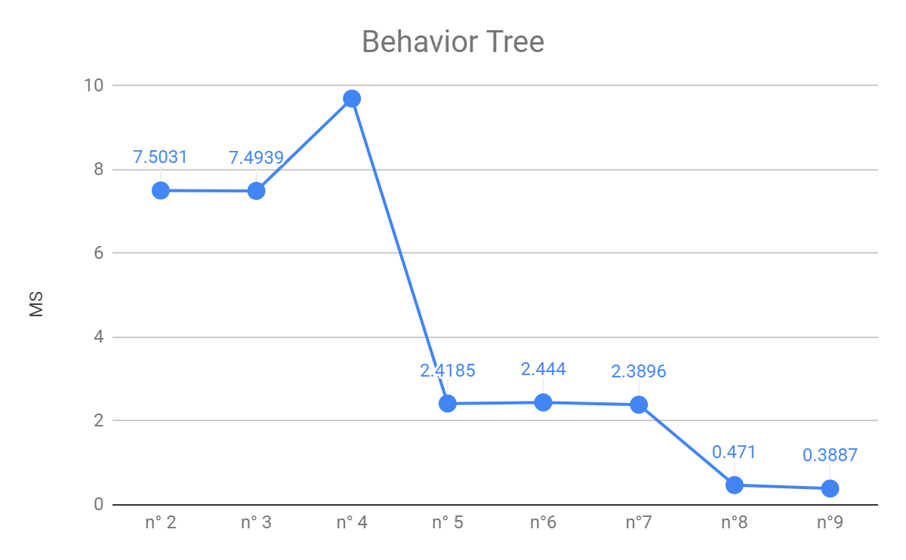

# Context
This is a school project conduct during my second year of Game Programming. Me and 6 other programmers where tasks to make a small city builder using a custom game engine in c++ made by our teacher. I had two main roles, the first was to be the **lead project** and the second was to be the **AI programmer**. We settle on doing a city builder in a dwarf univers and we team up with two other artists from our school that create the tilemape and the buildings.

# Developping the AI
My main job was to develop the ai for the game, it can be seen as two separate task:
- Behaviors : Going to work, moving resource between building, staying at home during night, etc
- Pathfinding : Going from A to B

## Behaviors
It was decided that any dwarf could have any type of job and that they would be allowed to choose their own home/working place. To do so what seemed to be the easiest solution was to have **a unique behavior tree for every dwarf**. Also as there was no dynamic events, the tree needed to be check only when a task was finished.

## Pathfinding
{:align="right" style="padding-left:16px; width: 350px;"}The main "threat" was that pathfinding would take too much time and completly slow down the game. The easiest solution was to implement a wainting queue and to compute only a small number of path each frame. This simple trick allowed the game to run at with **a maximum of 100'000 agents** at the same time.  

## Optimization
{:align="left" style="padding-right:16px; width: 350px;"}If you want to have a "behind the scene" with the optimization made to get to the 100'000 agents I've written [an article]() to understand every step to get to this number. This is not a tutorial, it just sum up every step taken from the basics implementation and to have a lsit of basics optimizations that can be made anywhere else. 

# Acting as the Lead Project for school's project
I won't say something new but being in a group can be challenging. My two main job with this role were to be sure that the project can keep on going without being stuck and to chose how everyone is working together. For me, my main concern was to make sure that someone cannot interfer with someone else'result as it was still a graded project. To achieve it we, with the lead programmer, came up with tasks with everyone that had no interferance between each other and that could easily be missing from the final result. 

This decision came at a certain price, if some parts are working just fine and that in the end we had good grades, there is no game. Which today is still something frustrating because we spent a lot of time speaking about the game design and having the image of the game in our minds. If I had to redo it today I think that I would create small team inside the overall team. Each team would have objectives, it would have switch our mind from having good grades to having a game.
