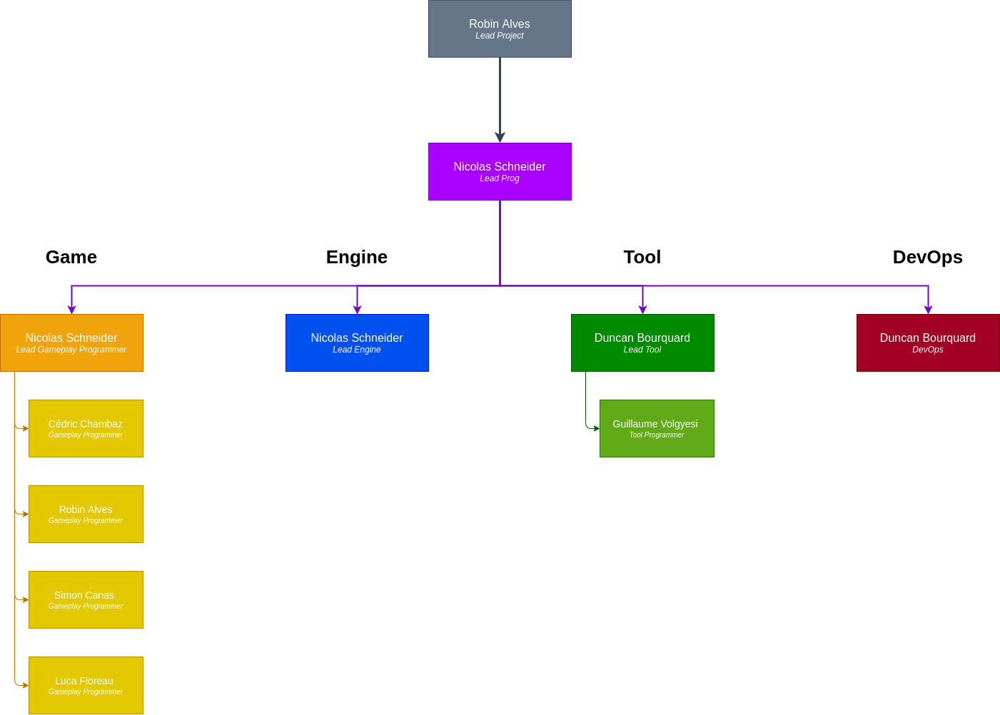
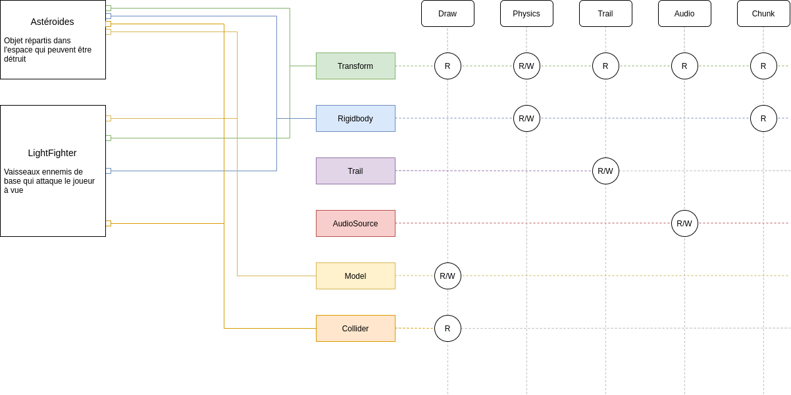

# Overview
The Pok's project is a **6 months school project** were me and other students had to make a **3D game engine** that could run on the **Nintendo Switch&trade;**. For this project I had two differents role; **Lead Programmer** and **Lead Engine**.

# Result
{:align="right" style="padding-left:16px; width: 350px;"}
I have mix feelings about the result. The engine and every needed tools have been made. For the game this is another story, the game could be seen as an early prototype. If you want to know more about what went wrong you can read this [post mortem]().

But I have learnt a lot throughout the entire project. Mainly in c++ and the following system:
- Vulkan and rendering in general
- Space partitionning 
- Multithreading
- Physics Engine
- Data oriented programming & ECS
- Resources management

You can have an in-depth look at two features. In this [article]() where I go in depth of how I implemented a **particle system**. And in this [one]() I'm speeking about **a simple multithreading system**. 

# Lead Programmer with 15 membres
{:align="left" style="padding-right:50px; width: 350px; margin-bottom: 70px"}
My **main tasks** as the lead programmer were:
- Managing the team and choosing our working tools
- Following the overall schedule decided by the lead project 
- Choosing an overall coding style and philosophy when coding
- Keeping everyone focused on the project

The **core team was made up of 5 members**:
- Lead Programmer / Lead Engine (myself)
- Lead Gameplay programmer 
- Lead Tools / DevOps
- Tool Programmer
- Gameplay Programmer

During the project we were join by our underclassmen who made tools for us both on Unity and our engine. At that time we were **15 membres** working on this project. We took **inspiration from Agile** with **sprints of two weeks** and used **Trello** to store task in form of cards.  

# Making a custome Game Engine
{:align="right" style="padding-left:16px; width: 350px;"}
As the Lead Engine I had to :
- Design the engine, those decision also influenced the two other teams: Tool and Game
- Managing the engine team
- Taking request from the other team and applied them

If you want to read more about those two roles, you can read this [post mortem]() that focus on those roles and how to work in a school project.
