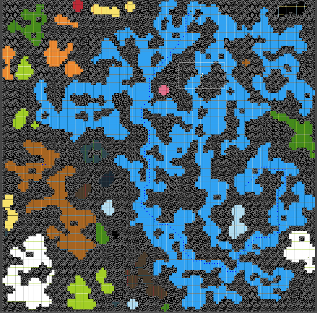
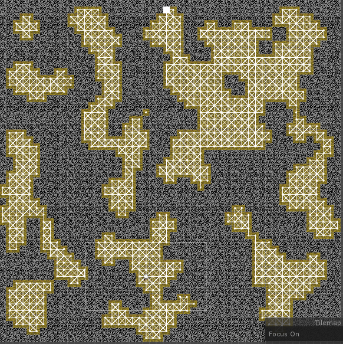

# Overview
This is my first project were I implemented AI and PCG for a game, I also wanted to try to use scriptable objects from Unity. The pitch is simple; as a space dwarf, go down on planet, get resource, and get out of the planet before being drown under the space goblins. 

# Procedural generated content 
{:align="right" style="padding-left:16px; width: 350px;"}
I used PCG as much as possible thoughout the project:
1. Generation of the level using **cellular automaton**
2. Finding small area and removing them
3. Linking region together
4. Creating sub-region (for spawn)
5. Spawning resources and enemies
6. Random generation of weapon using a **Markov Models** approach 

# AI
{:align="right" style="padding-left:16px; width: 350px;"}
The two core implementation I've made were the pathfinding and and decision making, it wasn't applied to whole group but only to single agent. For the pathfinding I implemented the **A* algorithm** and completed it with a security to have a maximum of agent that could request a path at the same time. Working with the tilemap of unity helped to already have a grid system and to build a **Waypoint Graph** on top of it was an easy task.

For the decision making instead of using state machine I opted for a **behavior tree using scriptable object**. Using scriptable object allowed me recycle every behavior and to build complexe agent directly from the editor. 
