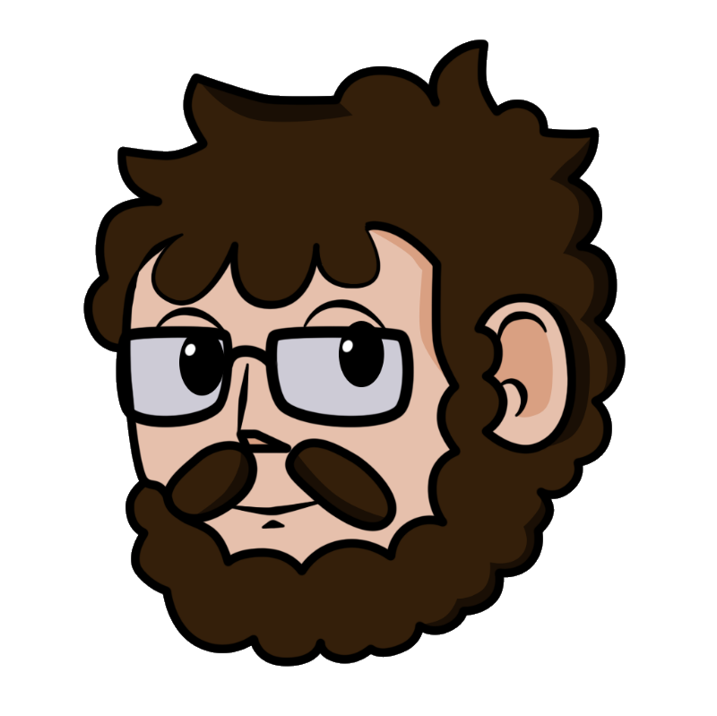

	

		

			

				 
				

					<h4>Nicolas Schneider</h4>
					I'm a game engine enthusiastic who love doing new things from scratch. 
					
					<h6><a href="../assets/pdfs/CV_2.pdf" target="_blank">My Resume</a></h6>
				

			

			

				

					<h2 style="margin-top: 10px">Skills</h2>
					<ul>
						<li><u>Languages:</u> C++, C#, JSON</li>
						<li><u>Version controle software:</u> Git</li>
						<li><u>Project management tools:</u> Trello, GitKraken</li>
						<li><u>Softwares:</u> Visual Studio, CLion, Rider, FMOD Studio</li>
						<li><u>Engines:</u> Unity</li>
					</ul>
				

			

		

		

			<h1 style="margin-top: 0px">About</h1>
			
Hi, I'm Nicolas Schneider. I'm currently a student at the SAE Institute of Geneva in <b>my last year in a game programming</b> courses. I'm mostly doing school project and game jams. 
			Most of my project are around <b>AI and procedural content generation</b> but my final goal is to be an engine programmer.   
			I've already done some work in that area, the first one was a 2D physics engine at the end of my first year. Then at the end of the second I've made a 3D graphics 
			small engine using Vulkan as the graphics API. Finally during my last year I've led a team and together we made a complete <a href="projects/pok_engine.html">3D engine</a> that runs on a pc and on the Nintendo Switch.

			<h1 style="margin-bottom: 20px;">Work Experiences</h1>
			

				

					
					<h3 style="margin-top: 10px">Lecturer & Supervisor</h3>
					
Current job
 
					
I'm currently a <b>teacher</b> at <a href="https://www.sae.swiss/" target="_blank">my school</a>. I'm in charge of most of the classes for the first year in game programming.

					My courses:
					<ul>
						<li>Basics of c++ and c#</li>
						<li>Unity</li>
						<li>AI : Pathfinding, decisions making</li>
						<li>Procedural generation content</li>
						<li>Math and Physics</li>
					</ul>
				

				
 
					
					<h3 style="margin-top: 10px">Internship at Team KwaKwa</h3>
					
September 2018 - February 2019

					
I worked at <a href="https://team-kwakwa.com/" target="_blank">Team KwaKwa</a> on their yet non-announced game.

					My Contributions:
					<ul>
						<li>Procedural generation of the open world</li>
						<li>Basics AI pathfinding and decision making</li>  
						<li>Participation on some event to showcase the game</li>
					</ul>
				

				

					
					<h3 style="margin-top: 10px">Internship at Oniroforge</h3>
					
May 2018

					
My first work experience was a Oniroforge on a <b>VR game</b> on the Occulus Rift and the Samsung Gear VR.

					My Contributions:
					<ul>
						<li>Construction of a level for the game</li>
						<li>Implementation of 3 ennemies</li>
						<li>Refactoring some UI to handle differents levels</li>
					</ul>
				

			

			<h1 style="margin-bottom: 20px;">Other stuff</h1>
			

				

					
					<h3 style="margin-top: 10px;">LvlUp Game Jam</h3>
					
Since 2018

					
Since 2018 I'm in the committee of a <a href="https://lvlupgamejam.ch/" target="_blank">Game Jam</a> that take place every year.

					Tasks:
					<ul>
						<li>Finding new sponsors</li>
						<li>Logistic during the event</li>
						<li>The organization</li>
					</ul>
				

				

					

						<iframe src="https://www.youtube.com/embed/4IqqYseWubY" style="width: 100%;"></iframe>
					

					<h3 style="margin-top: 10px;">Swiss Game Academy</h3>
					
Since 2018

					
This is a one week <a href="https://gameacademy.ch/SGA/" target="_blank">event</a> where we teach the basics of video game development with around one hundred people doing their first game.

					Tasks:
					<ul>
						<li>Staff management</li>
						<li>Coaching of participant</li>
						<li>Logistic during the event</li>
						<li>Advance lecture of programming</li>
					</ul>
				

			

			<h1 style="margin-bottom: 20px;">Education</h1>
			

				

					
				

				

					Game Programming 
					<a href="https://www.sae.swiss/" target="_blank">SAE Institute Geneva</a> 
					Bachelor of Science
				

				

					What I learnt
					<ul>
						<li>Languages: c++, c#, json</li>
						<li>Engines: Unity, Unreal Engine 4</li>
						<li>Custom game engines: Physics engine 2d, 3d renderer, complete 3d engine</li>
						<li>Project: How to start from scratch and managing it</li>
						<li>Team management: Socials skills and softwares</li>
						<li>Game Design: Fundamentals of loops and feedback/signes</li>
					</ul>
				

			

		

	

